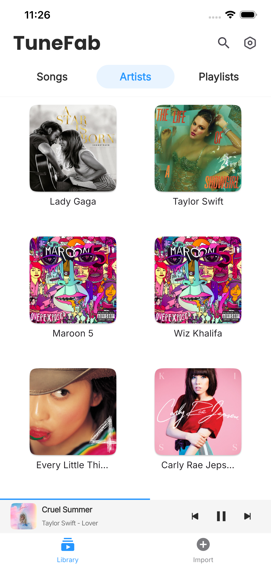
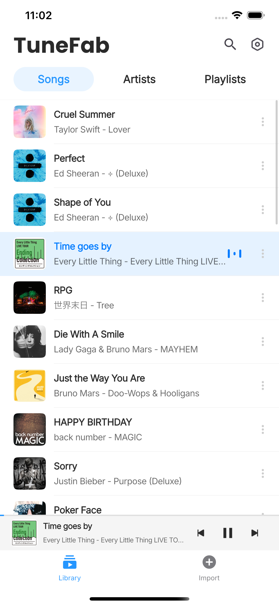
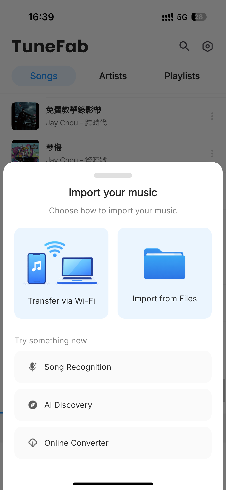
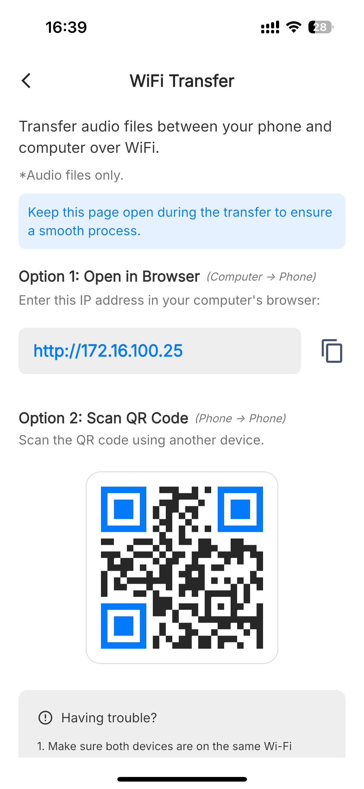

# TuneFab Player

TuneFab Player is a lightweight yet powerful music player for Android and iOS, designed to deliver a smooth, high-quality offline listening experience for locally stored audio files and saved music from platforms like Spotify, Apple Music, Amazon Music, and more.

It helps users organize, browse, import, and play their personal music library on mobile devices with a clean interface, stable playback, and practical controls for everyday listening.

---

## Core Features

- 🎵 Local Music Playback — play audio files stored on Android phones, Android tablets, iPhone, and iPad
- 🎶 Offline Platform Music Playback — play Spotify, Apple Music, Amazon Music, etc. offline on iOS/Android
- 📱 Cross-Platform Mobile Support — designed for both Android and iOS devices
- 📂 File Import Methods — import music through full-device scanning or WiFi transfer
- 🔎 Full-Device Scan — scan local storage to detect and organize available audio files
- 📡 WiFi Transfer — upload songs from a computer to your phone through the same WiFi network
- 📁 Music Library Management — browse songs, albums, artists, playlists, and folders
- ▶️ Smooth Playback Controls — play, pause, skip, repeat, shuffle, and manage playback queue
- 🎧 High-Quality Audio Experience — optimized for clear, stable, and immersive listening
- 🔍 Quick Search — quickly find songs, artists, albums, playlists, or local files
- 🌙 Clean Mobile Interface — simple, lightweight, and easy to use on different screen sizes
- 🔒 Offline Listening — enjoy local music without requiring a streaming account or network connection
- 🧩 Format Compatibility — support common audio formats for everyday music playback

---

## File Import Methods

TuneFab Player provides flexible ways to add music to your mobile library, making it easy to bring local songs into the app on both Android and iOS devices.

### Full-Device Scan

TuneFab Player can scan your device storage to find available audio files and add them to your music library.

This is useful when songs are already saved on your phone or tablet. After scanning, detected tracks can be organized and played directly inside TuneFab Player.

### WiFi Transfer

WiFi Transfer lets users upload songs from a computer to TuneFab Player without using a cable.

To use WiFi Transfer, the phone and computer must be connected to the same WiFi network.

#### Transfer Songs in 3 Steps

1. Connect to the same WiFi

   Make sure your phone and computer are on the same WiFi network.

2. Open Transfer via WiFi

   In TuneFab Player, tap **Transfer via WiFi** to get a transfer address.

3. Open the address on your computer

   Enter the address in your computer browser, then upload songs.

---

## About TuneFab Player

TuneFab Player is built for users who want a simple, reliable, and flexible music player for their mobile devices.

Unlike streaming-first music apps, TuneFab Player focuses on offline playback and locally stored audio files, giving users more control over their personal music collection. Whether users keep music on an Android phone, Android tablet, iPhone, or iPad, TuneFab Player makes it easy to import, browse, manage, and enjoy songs anytime, including saved music from Spotify, Apple Music, Amazon Music, and other platforms.

The app is designed for everyday listening, offline playback, and personal library management. It keeps the experience lightweight while still offering the essential features users expect from a modern mobile music player.

---

## Screenshots & Preview

| Artists | Home | Initial | Import Methods | WiFi Transfer |
|---|---|---|---|---|
|  |  |  |  |  |

---

## Why Use TuneFab Player?

| Feature | TuneFab Player | Generic Music Players |
|---|---|---|
| Android support | ✅  | ✅  |
| iOS support | ✅  | ⚠️  |
| Local music playback | ✅  | ✅  |
| Spotify / Apple Music / Amazon Music offline playback | ✅  | ⚠️  |
| Full-device scanning | ✅  | ⚠️  |
| WiFi transfer | ✅  | ⚠️  |
| Offline listening | ✅  | ⚠️  |
| Lightweight design | ✅ | ⚠️ |
| Library management | ✅ | ⚠️ |
| Simple playback controls | ✅ | ✅ |
| Personal music ownership | ✅ | ⚠️ |

---

## Use Cases

- Play Spotify, Apple Music, Amazon Music, etc. offline on iOS/Android
- Listen to downloaded music offline
- Import songs through full-device scanning
- Transfer music from a computer to a phone over WiFi
- Manage local songs on Android and iOS devices
- Play music without needing a streaming account
- Organize a personal music library by songs, albums, artists, and playlists
- Enjoy lightweight playback without unnecessary distractions
- Use a clean mobile player for everyday listening
- Keep personal audio files accessible across mobile devices

---

## System Requirements

- Android phone or tablet
- iPhone or iPad
- Local audio files stored on the device
- For WiFi Transfer: phone and computer connected to the same WiFi network
- Recommended: Android 8.0 or later
- Recommended: iOS 13 or later

---

## Advantages of TuneFab Player

- Clean and lightweight mobile music experience
- Designed for both Android and iOS users
- Supports full-device scanning and WiFi music transfer
- Supports offline playback for saved music from Spotify, Apple Music, Amazon Music, and more
- Focused on local music playback and offline listening
- Simple library browsing and playback controls
- Suitable for daily use, travel, study, work, and offline entertainment
- Gives users more control over their personal music collection

---

## SEO Keywords

TuneFab Player, Android music player, iOS music player, iPhone music player, iPad music player, local music player, offline music player, Spotify offline player, Apple Music offline player, Amazon Music offline player, WiFi music transfer, full-device music scan, mobile music player, MP3 player for Android, MP3 player for iPhone, TuneFab audio player, lightweight music app, music library player, offline audio player
