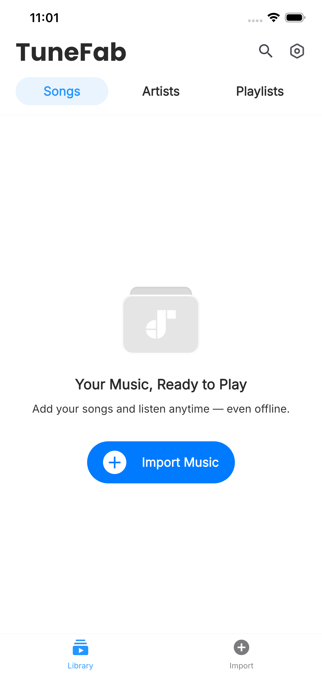
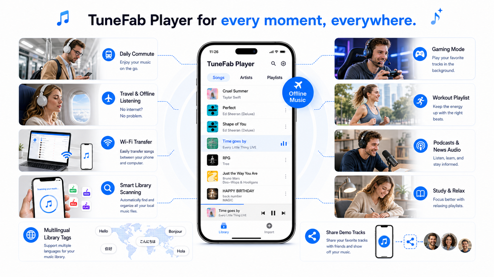

# TuneFab Player

TuneFab Player is a lightweight yet powerful music player for Android and iOS, designed to deliver a smooth, high-quality offline listening experience for locally stored audio files.

It helps users organize, browse, import, and play their personal music library on mobile devices with a clean interface, stable playback, and practical controls for everyday listening.

Explore more products of Tunefab，welcome to visit：www.tunefab.com

 

## Download TuneFab Player

Get TuneFab Player on Android and iOS.

| Google Play | App Store |
|---|---|
 | 

 

## Core Features

- 🎵 Local Music Playback — play audio files stored on Android phones, Android tablets, iPhone, and iPad
- 📱 Cross-Platform Mobile Support — designed for both Android and iOS devices
- 📂 File Import Methods — import music through full-device scanning or WiFi transfer
- 🔎 Full-Device Scan — scan local storage to detect and organize available audio files
- 📡 WiFi Transfer — upload songs from a computer to your phone through the same WiFi network
- 📁 Music Library Management — browse songs, albums, artists, playlists, and folders
- ▶️ Smooth Playback Controls — play, pause, skip, repeat, shuffle, and manage playback queue
- 🎧 High-Quality Audio Experience — optimized for clear, stable, and immersive listening
- 🔍 Quick Search — quickly find songs, artists, albums, playlists, or local files
- 🌙 Clean Mobile Interface — simple, lightweight, and easy to use on different screen sizes
- 🔒 Offline Listening — enjoy local music without requiring a streaming account or network connection
- 🧩 Format Compatibility — support common audio formats for everyday music playback

 

## File Import Methods

TuneFab Player provides flexible ways to add music to your mobile library, making it easy to bring local songs into the app on both Android and iOS devices.

### Full-Device Scan

TuneFab Player can scan your device storage to find available audio files and add them to your music library.

This is useful when songs are already saved on your phone or tablet. After scanning, detected tracks can be organized and played directly inside TuneFab Player.

### WiFi Transfer

WiFi Transfer lets users upload songs from a computer to TuneFab Player without using a cable.

To use WiFi Transfer, the phone and computer must be connected to the same WiFi network.

#### Transfer Songs in 3 Steps

1. Connect to the same WiFi

   Make sure your phone and computer are on the same WiFi network.

2. Open Transfer via WiFi

   In TuneFab Player, tap **Transfer via WiFi** to get a transfer address.

3. Open the address on your computer

   Enter the address in your computer browser, then upload songs.

 

## About TuneFab Player

TuneFab Player is built for users who want a simple, reliable, and flexible music player for their mobile devices.

Unlike streaming-first music apps, TuneFab Player focuses on offline playback and locally stored audio files, giving users more control over their personal music collection. Whether users keep music on an Android phone, Android tablet, iPhone, or iPad, TuneFab Player makes it easy to import, browse, manage, and enjoy songs anytime.

The app is designed for everyday listening, offline playback, and personal library management. It keeps the experience lightweight while still offering the essential features users expect from a modern mobile music player.

 

## Screenshots & Preview

| Artists | Home | Initial | Import Methods | WiFi Transfer |
|---|---|---|---|---|
|  |  |  |  |  |

 

## Why Use TuneFab Player?

| Feature | TuneFab Player | Generic Music Players |
|---|---|---|
| Android support | ✅  | ✅  |
| iOS support | ✅  | ⚠️  |
| Local music playback | ✅  | ✅  |
| Full-device scanning | ✅  | ⚠️  |
| WiFi transfer | ✅  | ⚠️  |
| Offline listening | ✅  | ⚠️  |
| Lightweight design | ✅ | ⚠️ |
| Library management | ✅ | ⚠️ |
| Simple playback controls | ✅ | ✅ |
| Personal music ownership | ✅ | ⚠️ |

 

## Use Cases

  

- Keep a personal offline music library on your phone without needing any streaming subscription.
- Listen to downloaded songs during commuting, flights, and other low‑signal situations.
- Import audio files from your computer and other devices, then sync them to your phone over Wi‑Fi for on‑the‑go listening.
- Scan your device storage to automatically find music files and organize them by songs, albums, artists, and playlists.
- Play background music while gaming on mobile without pop‑ups, ads, or in‑game interruptions.
- Build focused workout, running, and training playlists that stay available offline at the gym or outdoors.
- Save news programs, podcasts, and talk shows as audio files so avid news readers can listen anytime, anywhere.
- Create themed playlists for shopping, studying, relaxing, or social gatherings with friends.
- Manage multi‑language libraries (for example English, German, Japanese tracks) in one clean interface using custom playlists.
- Preview personal mixes, edits, and demo tracks on a phone before sharing them on social media or other platforms.
- Use a lightweight, distraction‑free mobile player for everyday listening with full control over your local audio files.

 

## System Requirements

- Android phone or tablet
- iPhone or iPad
- Local audio files stored on the device
- For WiFi Transfer: phone and computer connected to the same WiFi network
- Recommended: Android 8.0 or later
- Recommended: iOS 13 or later

 

## Advantages of TuneFab Player

- Clean and lightweight mobile music experience
- Designed for both Android and iOS users
- Supports full-device scanning and WiFi music transfer
- Focused on local music playback and offline listening
- Simple library browsing and playback controls
- Suitable for daily use, travel, study, work, and offline entertainment
- Gives users more control over their personal music collection

 

## SEO Keywords

TuneFab Player, Android music player, iOS music player, iPhone music player, iPad music player, local music player, offline music player, WiFi music transfer, full-device music scan, mobile music player, MP3 player for Android, MP3 player for iPhone, TuneFab audio player, lightweight music app, music library player, offline audio player

 
